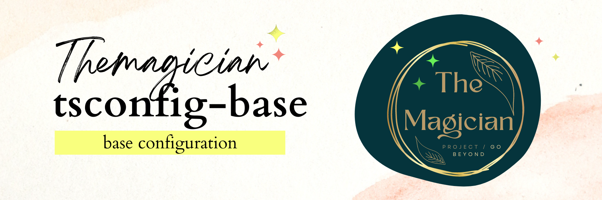

# tsconfig-base



[repo](https://github.com/TheMagicianDev/tsconfig), [npm](https://www.npmjs.com/package/@themagician/tsconfig-base)

A base tsconfig configuration that you can override.

# Usage:

Install the package:

```sh
npm install @themagician/tsconfig-base -D
yarn add @themagician/tsconfig-base -D
pnpm add @themagician/tsconfig-base -D
```

Then extend it in your tsconfig.json

```json
{
  "extends": "@themagician/tsconfig-base/tsconfig.json",
  "compilerOptions": {
    "noEmit": true,
    "strict": true
  }
}
```
# tsconfig-base configuration

```json
{
  "compilerOptions": {
    "target": "es2020",
    "module": "NodeNext",
    "allowJs": true,
    "declaration": true,
    "esModuleInterop": true,
    "forceConsistentCasingInFileNames": true,
    "strict": true,
    "skipLibCheck": true
  },
  "exclude": ["node-modules"]
}
```
