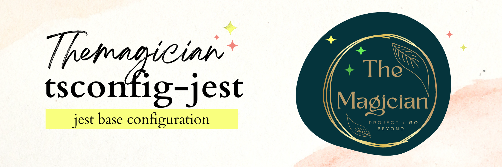

# tsconfig-jest



[repo](https://github.com/TheMagicianDev/tsconfig), [npm](https://www.npmjs.com/package/@themagician/tsconfig-jest)

A base tsconfig configuration for jest that you can override.

# Usage:

Install the package:

```sh
npm install @themagician/tsconfig-base -D
yarn add @themagician/tsconfig-base -D
pnpm add @themagician/tsconfig-base -D
```

Then extend it in your tsconfig.json

```json
{
  "extends": "@themagician/tsconfig-jest/tsconfig.json",
  "compilerOptions": {
    "noEmit": true,
    "strict": true
  }
}
```
# tsconfig-jest configuration

```json
{
  // TODO: Implement
  "$schema": "https://json.schemastore.org/tsconfig",
  "extends": "@themagician/tsconfig-base"
}
```
