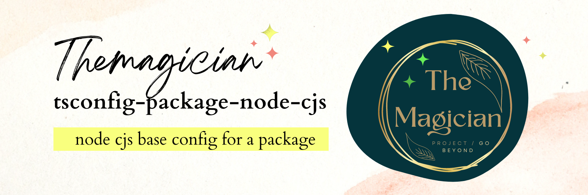

# tsconfig-base



[repo](https://github.com/TheMagicianDev/tsconfig), [npm](https://www.npmjs.com/package/@themagician/tsconfig-package-node-cjs)

A base tsconfig configuration for a node package project for a cjs build, that you can override.

# Usage:

Install the package:

```sh
npm install @themagician/tsconfig-base -D
yarn add @themagician/tsconfig-base -D
pnpm add @themagician/tsconfig-base -D
```

Then extend it in your tsconfig.json

```json
{
  "extends": "@themagician/tsconfig-package-node-cjs/tsconfig.json",
  "compilerOptions": {
    "noEmit": true,
    "strict": true
  }
}
```
# tsconfig-package-node-cjs configuration


```json
{
  "$schema": "https://json.schemastore.org/tsconfig",
  "extends": "@themagician/tsconfig-base",
  "compilerOptions": {
    "module": "CommonJS",
    "outDir": "dist/cjs"
  }
}
```
